# 지갑부터 만들어라

5개의 독립 블록체인 생태계를 솔로로 설계·구축·운영 중입니다.

---

## EverChain Ecosystem · [ever-chain.xyz](https://ever-chain.xyz)

| 체인 | 기반 | 특징 | 개발기간 | 탐색기 | 소스 |
|---|---|---|---|---|---|
| **BitEver (BEC)** | Bitcoin Core v30.2 | PoW, 포크블록 #478,558 | 25.07~25.10 | [탐색기](https://bitever.ever-chain.xyz) | [GitHub](https://github.com/makewalletfirst/BitEver) |
| ↳ **LightningEver (ever)** | Eclair LSP & Phoenix | BitEver에서 동작하는 단일 LSP 구조 자체 LN | 26.03~26.05 | [탐색기](https://lightningever.ever-chain.xyz) | [GitHub](https://github.com/makewalletfirst/LightningEver) |
| **EtherEver (ETE)** | Core-Geth (PoW) | 포크블록 #1,919,999, London HF | 25.10~25.12 | [탐색기](https://etherever.ever-chain.xyz) | [GitHub](https://github.com/makewalletfirst/EtherEver) |
| ↳ **ArbiEver (ETE)** | Arbitrum Nitro | AnyTrust (DAC 1인), ~250ms 블록 | 26.04~26.06 | [탐색기](https://arbiever.ever-chain.xyz) | [GitHub](https://github.com/makewalletfirst/ArbiEver.git) |
| **SolaEver (SLE)** | Agave / Solana v4.0 | Tower BFT, 400ms slot | 26.01~26.03 | [탐색기](https://solaever.ever-chain.xyz) | [GitHub](https://github.com/makewalletfirst/SolaEver4) |

각 체인마다 **노드 + 탐색기 + 지갑 → 풀스택 인프라**를 직접 구축했습니다.  
260731 서버 운영비 문제로 당분간 모든 체인 중단하고 데모 영상으로 갈음합니다

---

## 📹 데모 영상

<table>
  <tr>
    <td align="center"><b>BitEver (BEC)</b></td>
    <td align="center"><b>LightningEver (ever)</b></td>
    <td align="center"><b>EtherEver (ETE)</b></td>
    <td align="center"><b>ArbiEver (ETE)</b></td>
    <td align="center"><b>SolaEver (SLE)</b></td>
  </tr>
  <tr>
    <td align="center">
      
    </td>
    <td align="center">
      
    </td>
    <td align="center">
      
    </td>
    <td align="center">
      
    </td>
    <td align="center">
      
    </td>
  </tr>
</table>

---

<b>📐 전체 시스템 아키텍처 (클릭하여 펼치기 — 26 repo 한 그림에) <a href="https://github.com/makewalletfirst/EverChain-Architecture" target="_blank" onclick="event.stopPropagation()">[Mermaid repo]</a></b>

 

```mermaid
%%{ init: { 'theme': 'dark', 'flowchart': { 'curve': 'basis', 'nodeSpacing': 38, 'rankSpacing': 56 } } }%%
flowchart TB
  USER(("사용자")):::user
  PORTAL["EverChain Portal<br/>ever-chain.xyz"]:::portal
  USER --> PORTAL
  subgraph BTC_FAMILY["Bitcoin family"]
    direction TB
    subgraph BTC_L1["BitEver L1 BEC - Bitcoin Core v30.2 fork at 478558"]
      direction TB
      BE[("BitEver<br/>chain")]:::cpp
      BE_ELEC["BitEver-electrum<br/>Win + Android wallet"]:::py
      BE_MEMP["BitEver-mempool.space<br/>mempool dashboard"]:::docker
      BE_ESPL["BitEver-esplora<br/>Esplora explorer"]:::js
      BE_RPCX["BitEver-RPCexplorer<br/>RPC explorer"]:::js
      BE_ELEC -.uses RPC.-> BE
      BE_MEMP -.tails blocks.-> BE
      BE_ESPL -.indexes.-> BE
      BE_RPCX -.queries.-> BE
    end
    subgraph LN_L2["LightningEver L2 ever - single-node LSP"]
      direction TB
      LN_LSP[("LightningEver<br/>Eclair LSP fork")]:::scala
      LN_PLUG["LightningEver-eclair-plugin<br/>channel-funding 50M sat liquidity"]:::scala
      LN_KMP["LightningEver-eclair-kmp<br/>lightning-kmp fork"]:::kotlin
      LN_PHX["LightningEver-phoenix<br/>Phoenix Android app"]:::kotlin
      LN_EXPL["LightningEver-Explorer<br/>read-only 20s cache proxy"]:::js
      LN_RTL["LightningEver-RTL<br/>operator console fork"]:::ts
      LN_LSP --- LN_PLUG
      LN_LSP -.serves.-> LN_EXPL
      LN_LSP -.admin via.-> LN_RTL
      LN_KMP --- LN_PHX
      LN_PHX -.on-the-fly channel.-> LN_LSP
    end
    LN_LSP ==L1 swap-in auto channel==> BE
  end
  subgraph ETH_FAMILY["Ethereum family"]
    direction TB
    subgraph ETH_L1["EtherEver L1 ETE - Core-Geth PoW fork at 1919999"]
      direction TB
      EE[("EtherEver<br/>Go chain")]:::go
      EE_MM["EtherEver-Metamask<br/>MetaMask Mobile fork<br/>patch-package incoming-tx fix"]:::ts
      EE_BS["EtherEver-BlockScout<br/>Solc + WalletConnect"]:::elixir
      EE_MM -.RPC.-> EE
      EE_BS -.indexes.-> EE
    end
    subgraph ARB_L2["ArbiEver L2 ETE - Nitro AnyTrust"]
      direction TB
      AE[("ArbiEver<br/>Solidity chain<br/>Nitro stack")]:::sol
      AE_MM["ArbiEver-Metamask<br/>MetaMask Mobile fork<br/>4-fold safety net"]:::ts
      AE_BS["ArbiEver-BlockScout<br/>Solc + WalletConnect"]:::elixir
      AE_EXPL["ArbiEver-Explorer<br/>Alethio Lite"]:::shell
      AE_MM -.RPC.-> AE
      AE_BS -.indexes.-> AE
      AE_EXPL -.indexes.-> AE
    end
    AE ==Inbox / Outbox - Brotli batches==> EE
  end
  BRIDGE["EverChain-Bridge-Helper<br/>bridge.ever-chain.xyz<br/>3-tab dApp - L1-L2 deposit / L2-L1 withdraw / L1 execute"]:::html
  BRIDGE -.L1 tx.-> EE
  BRIDGE -.L2 tx.-> AE
  subgraph SOL_FAMILY["Solana family - independent"]
    direction TB
    subgraph SOL_L1["SolaEver L1 SLE - Agave v4.0 fork + Metaplex 8 program mirror"]
      direction TB
      SE[("SolaEver<br/>Rust validator<br/>u128 overflow patch")]:::rust
      SE_EXPL["SolaEver-Explorer<br/>Next.js fork<br/>SOLAEVER EXPLORER logo"]:::ts
      SE_WALL["SolaEver-wallet<br/>RN - Metaplex metadata auto-fetch"]:::ts
      SE_EXT["SolaEver-wallet-extension<br/>Chrome extension"]:::ts
      SE_EXPL -.RPC.-> SE
      SE_WALL -.RPC + Metaplex PDA.-> SE
      SE_EXT -.RPC.-> SE
    end
  end
  PORTAL ==> BE
  PORTAL ==> LN_LSP
  PORTAL ==> EE
  PORTAL ==> AE
  PORTAL ==> SE
  PORTAL ==> BRIDGE
  subgraph META["Profile / Assets"]
    direction LR
    PROF["makewalletfirst<br/>profile README"]:::doc
    STATS["github-readme-stats<br/>fork - stats badge"]:::doc
    IMG["image<br/>shared brand assets"]:::doc
  end
  classDef user fill:#1e293b,stroke:#38bdf8,color:#e0f2fe,stroke-width:2px
  classDef portal fill:#312e81,stroke:#a5b4fc,color:#e0e7ff,stroke-width:2px
  classDef cpp fill:#00427e,stroke:#5b8def,color:#fff
  classDef rust fill:#7c2d12,stroke:#fb923c,color:#fff
  classDef go fill:#0f4c5c,stroke:#0ea5e9,color:#fff
  classDef sol fill:#525252,stroke:#a3a3a3,color:#fff
  classDef py fill:#1e3a8a,stroke:#60a5fa,color:#fff
  classDef ts fill:#1e3a8a,stroke:#818cf8,color:#fff
  classDef js fill:#854d0e,stroke:#facc15,color:#fff
  classDef elixir fill:#5b21b6,stroke:#c084fc,color:#fff
  classDef scala fill:#7f1d1d,stroke:#f87171,color:#fff
  classDef kotlin fill:#5b21b6,stroke:#a78bfa,color:#fff
  classDef docker fill:#1e40af,stroke:#3b82f6,color:#fff
  classDef shell fill:#374151,stroke:#9ca3af,color:#fff
  classDef html fill:#9d174d,stroke:#f472b6,color:#fff
  classDef doc fill:#1f2937,stroke:#6b7280,color:#d1d5db
  click BE "https://github.com/makewalletfirst/BitEver" _blank
  click BE_ELEC "https://github.com/makewalletfirst/BitEver-electrum" _blank
  click BE_MEMP "https://github.com/makewalletfirst/BitEver-mempool.space" _blank
  click BE_ESPL "https://github.com/makewalletfirst/BitEver-esplora" _blank
  click BE_RPCX "https://github.com/makewalletfirst/BitEver-RPCexplorer" _blank
  click LN_LSP "https://github.com/makewalletfirst/LightningEver" _blank
  click LN_PLUG "https://github.com/makewalletfirst/LightningEver-eclair-plugin" _blank
  click LN_KMP "https://github.com/makewalletfirst/LightningEver-eclair-kmp" _blank
  click LN_PHX "https://github.com/makewalletfirst/LightningEver-phoenix" _blank
  click LN_EXPL "https://github.com/makewalletfirst/LightningEver-Explorer" _blank
  click LN_RTL "https://github.com/makewalletfirst/LightningEver-RTL" _blank
  click EE "https://github.com/makewalletfirst/EtherEver" _blank
  click EE_MM "https://github.com/makewalletfirst/EtherEver-Metamask" _blank
  click EE_BS "https://github.com/makewalletfirst/EtherEver-BlockScout" _blank
  click AE "https://github.com/makewalletfirst/ArbiEver" _blank
  click AE_MM "https://github.com/makewalletfirst/ArbiEver-Metamask" _blank
  click AE_BS "https://github.com/makewalletfirst/ArbiEver-BlockScout" _blank
  click AE_EXPL "https://github.com/makewalletfirst/ArbiEver-Explorer" _blank
  click BRIDGE "https://github.com/makewalletfirst/EverChain-Bridge-Helper" _blank
  click SE "https://github.com/makewalletfirst/SolaEver4" _blank
  click SE_EXPL "https://github.com/makewalletfirst/SolaEver-Explorer" _blank
  click SE_WALL "https://github.com/makewalletfirst/SolaEver-wallet" _blank
  click SE_EXT "https://github.com/makewalletfirst/SolaEver-wallet-extension" _blank
  click PROF "https://github.com/makewalletfirst/makewalletfirst" _blank
  click STATS "https://github.com/makewalletfirst/github-readme-stats" _blank
  click IMG "https://github.com/makewalletfirst/image" _blank
```

> 굵은 화살표 = 사용자 흐름 · 점선 = 인프라 의존 (RPC / index / proxy) · 각 노드 클릭 → repo

---

## 직접 건드린 것들

- **C++** — Bitcoin Core chainparams, magic bytes 수정
- **Rust** — Solana validator u128 overflow 버그 패치 (`runtime/src/inflation_rewards`)
- **Go / Smart Contracts** — Core-Geth fork (Nethermind 모드 활성화), Arbitrum Nitro v3.2.1 fork (legacy tx 강제 처리 및 EIP-150/London baseFee 숨김 대응 패치), L1에 22개 Rollup 템플릿 배포 및 AnyTrust DAC 노드 구축
- **TypeScript / Hardhat** — L1 EtherEver 가스 모델(EIP-1559 미지원) 및 환경에 맞춰 `nitro-contracts` v2.1.3 롤백, Solidity 컴파일러 다운그레이드(`evmVersion: "london"`)
- **Solidity** — ArbiEver 배포용 스마트 컨트랙트 커스텀 패치 (`ArbitrumChecker` 가스 전소 우회, `SequencerInbox` EIP-4844 참조 제거 등)
- **DevOps / L1 Scripting** — 사전 서명 tx 거부 우회를 위한 EIP-155 서명 CREATE2 Factory 직접 배포 및 30M 가스 리밋 환경 내 분할 컨트랙트 배포
- **Python** — custom `proxy.py` (Esplora API 번역), `bootstrap.dat` 생성 스크립트, SolaEver `spltoken.py` 원스텝 토큰 발행 자동화 (Metaplex metadata + 이미지 GitHub raw 호스팅 + send 까지)
- **TypeScript** — Next.js Solana Explorer fork (SolaEver 로고/RPC), EtherEver⇄ArbiEver Bridge Helper 단일 페이지 dApp (L1↔L2 입금/출금/L1 인출 3-탭, localStorage 미인출 트랜잭션 보관)
- **Elixir** — BlockScout fork, SSL/WebSocket 수정, EtherEver·ArbiEver Blockscout 양쪽 모두 Solc 컴파일러 + WalletConnect Write Contract UI 추가
- **React Native** — MetaMask Mobile fork (Android 전용, iOS 추후 지원 예정, EtherEver 전용 + ArbiEver 전용), **4-fold safety net** (셀렉터 화이트리스트 + NetworkController init cleanup + MultichainNetworkController 빈 state + PREINSTALLED_SNAPS surgical 제외) 으로 두 체인 제외한 모든 EVM/비-EVM 차단; SolaEver 전용 RN Wallet 에 **Metaplex metadata 자동 fetch** (mint 주소 입력 시 name/symbol/image 즉시 표시 + AsyncStorage 24h 캐시)
- **patch-package (`@metamask/transaction-controller`)** — v7.62 의 `AccountsApiRemoteTransactionSource` 가 메타마스크 자체 API 만 호출하던 것을 Blockscout etherscan-compatible API 로 우회 → 받는 ETE 트랜잭션이 활동탭에 정상 표시
- **Python/Qt** — Electrum fork (Windows + Android)
- **Scala** — ACINQ Eclair fork (musig2 nonce ordering 5곳 + Setup chain-sync assert 우회 + on-the-fly funding 인터셉터 플러그인 자체 구현, BitEver LSP 단일 노드 운영)
- **Kotlin** — ACINQ lightning-kmp fork (musig2 nonce 정렬 6+1곳, Electrum feerate fallback, Negotiating 상태 복원) + Phoenix Android fork (LightningEver 앱: BitEver chainHash 매핑, 자체 LSP 하드코딩, 앱 아이콘/브랜딩)
- **Node.js / Express** — LightningEver Explorer (eclair `/getinfo` `/channels` `/audit` 를 in-memory 20s 캐시 뒤로 프록시, mempool.space 톤 read-only 대시보드, eclair admin API 는 공개 X)
- **Angular / RTL fork** — LightningEver-RTL (Ride The Lightning) LSP 운영자 대시보드 — Eclair backend + 자체 LN 브랜딩
- **Docker / Nginx** — Alethio Lite 및 Blockscout 풀스택 프록시 커스텀, EverChain 인프라 전체 `docker compose` 기반 완전 도커화, EverChain Bridge Helper 정적 페이지 구현(silverruler/everchain-bridge-helper), SolaEver Explorer Next.js standalone 이미지 svg 도입 (silverruler/solaever-explorer)

모든 레포는 **GitHub Actions CI 통과 + 실제 Ubuntu 빌드·운영 확인** 기준으로만 올립니다.

---

## 📈 Stats & Activity

  
  

## 최근 완료 작업 (260531)

- **ArbiEver L2 풀스택 구축 완료** — EtherEver L1 위 Arbitrum Nitro 기반 커스텀 롤업(AnyTrust):
  - CREATE2 Factory 직접 배포 + 22개 Rollup 템플릿 배포 성공
  - Sequencer / Batch Poster / Validator 분리 + 단일 노드 DAC 구성
  - L1↔L2 자금 관문(Inbox/Outbox) 검증 + Brotli 압축 L2 배치를 L1 에 기록
- **LightningEver 풀스택 구축 완료** — BitEver L1 위 단일 LSP 구조의 자체 Lightning Network. 7가지 사용자 시나리오 전부 검증 (L1 swap-in 자동 채널 + 입금액 4X sat 유동성 / Bolt12 양방향 / on-the-fly 채널 자동생성 / splice-out / mutual close / Force close 144블록 CSV / Request Liquidity splice-in)
- **LightningEver Explorer + RTL 운영자 대시보드 도입** — eclair admin API 를 노출하지 않으면서 mempool.space 톤의 read-only 대시보드 운영, RTL fork 로 LSP 운영자 콘솔 분리
- **ArbiMask (MetaMask Mobile fork)** — EtherEver+ArbiEver 두 chain 만 노출하는 4-fold safety net, ArbiEver L2 ticker 큰/작은 아이콘, splash 일괄 교체, `UnifiedTransactionsView` 분기로 활동탭 ArbiEver스캔 라우팅, Korean activity label, Metro lint 우회. EtherEver 전용 EtherMask 도 동일 패턴 적용
- **EtherMask 받는 트랜잭션 fix** — `patch-package` 로 `AccountsApiRemoteTransactionSource` 의 SUPPORTED_CHAIN_IDS 에 `0xe2c3` 추가 + Blockscout etherscan-compatible API 호출 분기 → 받는 ETE 가 활동탭에 정상 표시
- **EtherEver ⇄ ArbiEver Bridge Helper 정적 사이트** — 단일 페이지 3-탭 (L1 입금 / L2 출금 시작 / L1 인출 실행), 출금 후 추천 인출 시점 표시, **localStorage 미인출 트랜잭션 보관** (페이지 닫아도 유지 + 30초 카운트다운). Docker Hub `silverruler/everchain-bridge-helper`
- **Blockscout (EtherEver / ArbiEver) 양쪽 모두 Solc 컴파일러 + WalletConnect Write Contract UI 추가** — 컨트랙트 호출 UX 가 메타마스크 외 모바일 지갑까지 확장
- **SolaEver Metaplex 생태계 mirror** — mainnet 의 8개 메타플렉스 프로그램(Token Metadata / Token Auth Rules / Bubblegum / SPL Account Compression / NoOp / Candy Machine Core / Candy Guard / Hydra) 을 `solana-test-validator --bpf-program` 으로 시동 args 에 박아 매 ledger reset 시 자동 재등록. `metaplex.py` 한 번이면 끝
- **SolaEver SPL 토큰 원스텝 발행 (`spltoken.py`)** — 토큰명/심볼/이미지/decimals/supply 입력 → 이미지·metadata.json 을 GitHub raw 자동 호스팅 → mint + supply + Metaplex 메타데이터 등록 → (옵션) 특정 주소로 송금까지 한 번에. testMETA / LNsola 발행 검증 완료
- **SolaEver 전용 Wallet (RN) — Metaplex 자동 인식** — `fetchTokenMetadata`: mint 주소 입력 시 Metaplex PDA 의 borsh 데이터를 직접 deserialize 해 name/symbol/uri 를 가져오고 uri 의 JSON 에서 image URL 까지 fetch. 토큰 추가 즉시 이름·티커·이미지 자동 표시
- **SolaEver Explorer 로고 재작성** — favicon embed + `SOLAEVER` (큰) + `EXPLORER` (작은) SVG 다크/라이트 두 버전 직접 작성. Docker Hub `silverruler/solaever-explorer:latest` + `:260531` 갱신
- **인프라 마이그레이션 완료** — LightningEver/ArbiEver 를 개발서버(10.8.0.XX) → 운영서버(10.8.0.X) BitEver 노드와 통합 도커화
---

## 현재 진행(계획) 중

- 모든 인프라 Site / URL 의 OG 메타데이터 변경
- 비트에버(L1)<->이더에버(L1)<->솔라에버(L1) 스왑 구현
- 비트에버 난이도 패치 / rpc 탐색기 local 시간 자동화 / 비트에버 이미지 변경
- 이더에버(L1)<->아비에버(L2) 스왑 데모 시연 영상 제작
- 이더에버(L1) 블록스카우트에 모든 solc 추가 및 영구 도커반영
- 아비에버(L2) 측 스왑 컨트랙트 all verify
- 라이트닝에버(L2) BIP353 DNS 어드레스 구현
- 라이트닝에버(L2) 소액남았을 때 출금시 강제 채널 붕괴 수정
- 라이트닝에버(L2) 전용 탐색기에서 24H 결제 내역 항상 0 수정
- 솔라에버(L1) 검증자 연결 테스트 (8025~8100 포트)
---

